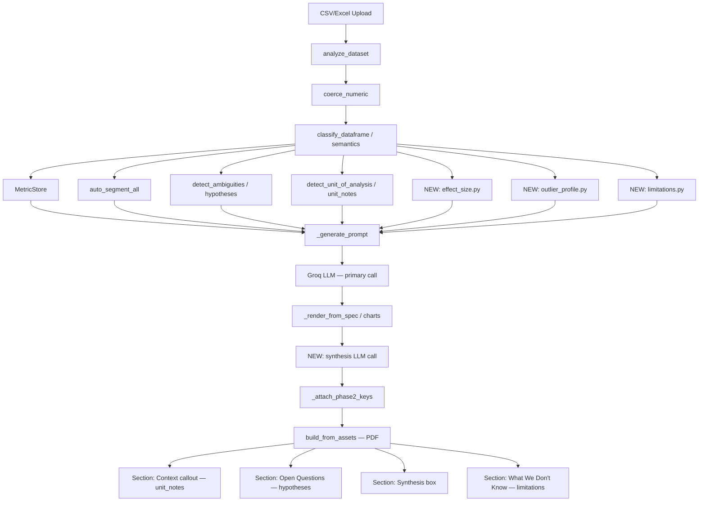
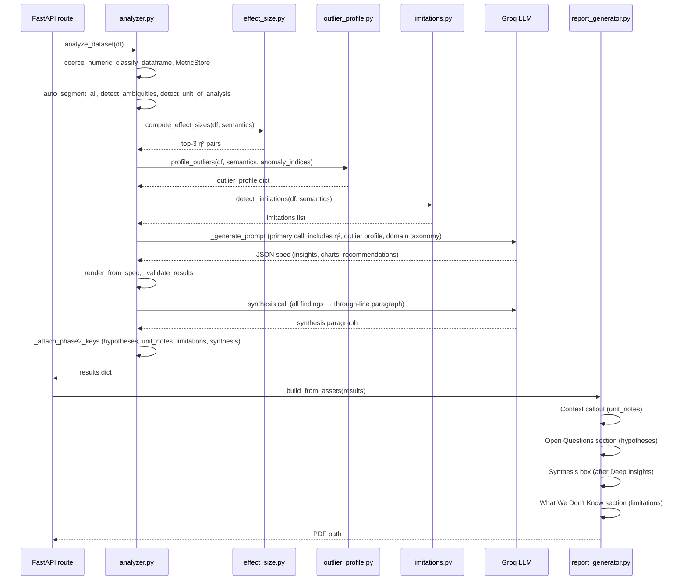

# Design Document: InsightStream 7.5 → 9.5 Upgrade

## Overview

InsightStream is a Python FastAPI backend that accepts CSV/Excel uploads, runs LLM-based
analysis via Groq (llama-4-scout), and generates PDF reports via ReportLab. The system
currently scores 7.5/10 on report quality. This upgrade implements 10 targeted improvements
across two tiers to reach 9.5/10.

The existing pipeline already computes rich data (`hypotheses`, `unit_notes`, `segmentations`,
`MetricStore`, `IsolationForest` anomalies) but does not surface all of it in the PDF. Tier 1
fixes mechanical gaps (rendering, prose cleanup, prompt rules). Tier 2 adds new reasoning
modules (effect size, outlier characterization, synthesis pass, limitations).

All new modules live in `engine/analysis/` or `engine/render/`. PDF changes go in
`report_generator.py::build_from_assets`. LLM prompt changes go in
`analyzer.py::_generate_prompt`. New LLM calls go in `analyzer.py::analyze_dataset`.
Cache version is bumped after every prompt change.


## Architecture




## Sequence Diagram — analyze_dataset (post-upgrade)




---

## Tier 1 — Mechanical Improvements (7.5 → 8.5)

### Item 1: Render hypotheses + unit_notes in PDF

**Problem:** `results["hypotheses"]` and `results["unit_notes"]` are computed by
`detect_ambiguities()` and `detect_unit_of_analysis()` and attached by `_attach_phase2_keys()`,
but `build_from_assets` never reads them. They exist in the JSON result but are invisible in
the PDF.

**Design:**

`build_from_assets` receives `insights`, `recommendations`, `text_blocks`, etc. but not
`hypotheses` or `unit_notes`. The fix adds two new keyword parameters and two new PDF sections.

```pascal
PROCEDURE build_from_assets(... hypotheses=[], unit_notes=[])
  // After Executive Summary section, before charts:
  IF unit_notes IS NOT EMPTY THEN
    RENDER context_callout_box(unit_notes)
  END IF

  // After Deep Insights section (section 6), before Recommendations:
  IF hypotheses IS NOT EMPTY THEN
    RENDER open_questions_section(hypotheses)
  END IF
END PROCEDURE

PROCEDURE context_callout_box(unit_notes)
  // Tinted callout box (light blue background)
  FOR each note IN unit_notes DO
    RENDER "Context: " + note.note
  END FOR
END PROCEDURE

PROCEDURE open_questions_section(hypotheses)
  RENDER section header "Open Questions"
  FOR each h IN hypotheses DO
    RENDER h.observation AS bold paragraph
    FOR each candidate IN h.candidates DO
      RENDER "• " + candidate AS bullet
    END FOR
    RENDER "To resolve: " + h.disambiguating_info AS italic note
  END FOR
END PROCEDURE
```

The caller (`insight_engine.py` or the route) must pass `hypotheses` and `unit_notes` from
the `results` dict into `build_from_assets`.

**DONE_WHEN:** A PDF generated from the credit-card CSV contains a "Context" callout with
"rows are at card level" text AND an "Open Questions" section listing at least one hypothesis
about zero values in a monetary column.


### Item 2: Key Takeaway synthesis

**Problem:** The Key Takeaway insight currently restates finding #1 verbatim. The prompt
rule says "synthesize" but does not enforce cross-finding reference.

**Design:**

Add a new rule to `_generate_prompt` that explicitly requires the Key Takeaway to name at
least two other findings and state the through-line connecting them.

```pascal
// In _generate_prompt, replace the existing Key Takeaway rule with:
KEY_TAKEAWAY_RULE =
  "- Key Takeaway (MANDATORY): The FIRST insight must be titled 'Key Takeaway'.
     It MUST reference at least 2 other findings by their exact title and state
     the through-line that connects them. Format:
     '[Finding A title] and [Finding B title] both point to [through-line]:
     [one striking sentence with a specific number].'
     Do NOT restate a single finding. Do NOT use generic phrases.
     Example: 'The 73x spread in credit_limit across card_type and the 96%
     outlier concentration in Credit cards both point to the same root cause:
     prepaid cards are stored-value products, not credit lines, and must be
     segmented before any credit-risk modeling.'"
```

Cache version bumped from `v3` → `v4` after this change.

**DONE_WHEN:** The Key Takeaway text in the PDF contains the word "and" connecting two
distinct finding titles, and does not begin with the same sentence as finding #2.


### Item 3: Clean prose artifacts

**Problem:** Segmentation headline templates use `COLUMN=VALUE` syntax (e.g.,
`card_type=Debit (Prepaid)`). The `fill_metrics` filler resolves `{{metric:...}}` placeholders
but does not clean up the `COLUMN=VALUE` pattern. This bleeds into finished prose.

**Design:**

Add a post-fill cleanup step in `engine/render/metric_filler.py` (or a new
`engine/render/prose_cleaner.py`) that applies regex substitution after metric filling.

```pascal
PROCEDURE clean_prose_artifacts(text)
  // Pattern: WORD=VALUE where WORD is a column name
  // Replace with natural-language equivalent

  // Step 1: Build replacement map from known column→value patterns
  // e.g. "card_type=Debit (Prepaid)" → "prepaid debit cards"
  //      "card_type=Credit"          → "credit cards"
  //      "card_brand=Visa"           → "Visa cards"
  //      "has_chip=YES"              → "chip-enabled cards"

  FOR each match OF pattern r'\b(\w+)=([^\s,]+(?:\s+\([^)]+\))?)\b' IN text DO
    col   = match.group(1)
    value = match.group(2)
    replacement = _natural_language(col, value)
    text = text.replace(match.group(0), replacement)
  END FOR

  RETURN text
END PROCEDURE

FUNCTION _natural_language(col, value)
  // Generic fallback: "col value" → title-cased, underscores removed
  col_clean   = col.replace("_", " ").lower()
  value_clean = value.replace("_", " ").strip("()")
  RETURN value_clean + " " + col_clean
END FUNCTION
```

This cleaner is called on every segmentation headline before it is written to the PDF,
and on every insight `text` field in `_attach_phase2_keys`.

**DONE_WHEN:** No `COLUMN=VALUE` pattern (regex `\b\w+=\S+`) appears in any paragraph of
the generated PDF.


### Item 4: Chart captions with currency formatting

**Problem:** `_generate_chart_summary()` in `analyzer.py` formats numeric values with
Python's default `f"{v:,.2f}"` — it does not use `MetricStore.format(key, fmt="currency")`.
The `fmt:currency` fix applied to segmentation headlines (via `fill_metrics`) never reached
chart captions, so monetary columns show raw floats like `18558.23` instead of `$18.6K`.

**Design:**

`_generate_chart_summary` receives `df` but not `semantics` or `MetricStore`. The fix
passes both and applies currency formatting when the column is tagged `monetary`.

```pascal
PROCEDURE _generate_chart_summary(chart_type, x_col, y_col, df,
                                   semantics=None, store=None)
  // Determine if y_col (or x_col for histograms) is monetary
  is_monetary_x = (semantics AND x_col IN semantics
                   AND semantics[x_col].tag == "monetary")
  is_monetary_y = (semantics AND y_col IN semantics
                   AND semantics[y_col].tag == "monetary")

  FUNCTION fmt_val(v, col)
    IF store IS NOT NULL AND col IS NOT NULL THEN
      key = MetricKey(col, "mean")
      IF key IN store THEN
        IF (col == x_col AND is_monetary_x)
           OR (col == y_col AND is_monetary_y) THEN
          RETURN store.format(key, fmt="currency")
        END IF
      END IF
    END IF
    RETURN f"{v:,.2f}"
  END FUNCTION

  // Use fmt_val() wherever a numeric value is formatted in the caption
END PROCEDURE
```

`_generate_chart_summary` is called from `_render_from_spec` via `_make_chart_dict`.
`_render_from_spec` already has access to `semantics` (passed from `analyze_dataset`).
The `store` is built once in `analyze_dataset` and passed through.

**DONE_WHEN:** A chart caption for a monetary column (e.g., `credit_limit`) shows
`$18.6K` or `$18,558` rather than `18558.23`.


### Item 5: Better recommendations

**Problem:** Recommendations are often generic ("investigate underlying drivers"). The
existing prompt Rule 10 asks for column references but does not require named owners,
imperative verbs, or specific timeframes tied to findings.

**Design:**

Replace the existing Rule 10 in `_generate_prompt` with a stricter rule that enforces
the imperative-owner-timeframe structure.

```pascal
BETTER_RECOMMENDATIONS_RULE =
  "- Rule 10 — Recommendations (MANDATORY structure): Generate 3-5 recommendations.
     Each MUST follow this exact structure:
     1. Start with an imperative verb (Audit, Segment, Investigate, Build, Flag, etc.)
     2. Name the specific column(s) involved
     3. State the specific action with a concrete number from the data
     4. Assign an owner (e.g., 'Owner: Data Engineering', 'Owner: Risk Analytics')
     5. State a timeframe (e.g., 'Timeframe: 2 weeks', 'Timeframe: Next sprint')

     Example:
     'Audit the data pipeline to confirm whether prepaid balances are stored in
     credit_limit. The 73x spread (prepaid mean=$64 vs debit mean=$18,558) suggests
     a data-modeling artifact. Owner: Data Engineering. Timeframe: 2 weeks.'

     FORBIDDEN phrases: 'investigate underlying drivers', 'optimise operations',
     'consider reviewing', 'may want to', 'could potentially'.
     Every recommendation must be actionable by a named team within a named timeframe."
```

Cache version bumped (already bumped for Item 2; same bump covers both).

**DONE_WHEN:** All recommendations in the PDF begin with an imperative verb, contain
"Owner:" and "Timeframe:" labels, and none contain the phrase "underlying drivers".


---

## Tier 2 — Reasoning Improvements (8.5 → 9.5)

### Item 6: Domain reasoning injection

**Problem:** When `domain_classifier` returns `FINANCE/CREDIT`, the LLM prompt has no
domain-specific semantic context. It treats `credit_limit=0` for prepaid cards as a
credit-risk finding rather than a data-modeling artifact.

**Design:**

Add a `DOMAIN_TAXONOMY` dict in `engine/classifiers/domain.py` (or a new
`engine/classifiers/domain_taxonomy.py`). When the classified domain is `FINANCE` or
`CREDIT`, inject a taxonomy block into `_generate_prompt`.

```pascal
DOMAIN_TAXONOMY = {
  "FINANCE": {
    "CREDIT": {
      "block": """
=== FINANCE/CREDIT DOMAIN TAXONOMY ===
credit_limit semantics differ by card_type:
  - Prepaid cards: credit_limit = stored value loaded by cardholder.
    A low or zero credit_limit is EXPECTED and is NOT a credit-risk signal.
    Do NOT write 'prepaid cards have low credit limits' as a risk finding.
    Write: 'prepaid cards store value differently — credit_limit reflects
    loaded balance, not a credit line.'
  - Standard debit cards: credit_limit = overdraft facility or not applicable.
  - Credit cards: credit_limit = approved revolving credit line.
Any cross-type comparison of credit_limit means is a DATA-MODELING ARTIFACT,
not a business finding, unless the report explicitly segments by card_type first.
=== END TAXONOMY ===
"""
    }
  }
}

PROCEDURE inject_domain_taxonomy(domain_info, df, semantics)
  category = domain_info.get("category", "")
  IF category IN ("FINANCE", "CREDIT", "FINANCE_CREDIT") THEN
    // Check if credit-related columns exist
    has_credit_cols = any col IN semantics WHERE
      col.lower() IN ("credit_limit", "card_type", "card_brand")
    IF has_credit_cols THEN
      RETURN DOMAIN_TAXONOMY["FINANCE"]["CREDIT"]["block"]
    END IF
  END IF
  RETURN ""
END PROCEDURE
```

This block is injected into `_generate_prompt` as a new `domain_taxonomy_block` parameter,
placed before the column list so the LLM reads it before seeing the data.

**DONE_WHEN:** For a credit-card CSV, the Key Takeaway or a finding contains the phrase
"data-modeling artifact" or "stored-value" (or equivalent) rather than framing the
prepaid/credit_limit gap as a credit-risk finding.


### Item 7: η² effect size module

**Problem:** The LLM has no ground-truth measure of how much variance each categorical
variable explains. It may rank findings by spread ratio (which is sensitive to outliers)
rather than by actual explanatory power.

**Design:**

New module `engine/analysis/effect_size.py`.

```pascal
STRUCTURE EffectSize
  group_col   : str
  target_col  : str
  eta_squared : float   // 0..1, proportion of variance explained
  f_statistic : float
  p_value     : float
  is_significant : bool  // p < 0.05
END STRUCTURE

PROCEDURE compute_effect_sizes(df, semantics) → list[EffectSize]
  results = []
  cat_cols = [c FOR c IN semantics WHERE semantics[c].tag == "categorical_meaningful"]
  num_cols = [c FOR c IN semantics WHERE semantics[c].tag IN ("monetary", "numeric_meaningful")]

  FOR each group_col IN cat_cols DO
    FOR each target_col IN num_cols DO
      IF NOT is_numeric(df[target_col]) THEN CONTINUE END IF

      groups = [df[target_col][df[group_col] == v].dropna()
                FOR v IN df[group_col].unique() IF count >= 2]
      IF len(groups) < 2 THEN CONTINUE END IF

      // One-way ANOVA
      f_stat, p_val = scipy.stats.f_oneway(*groups)
      IF isnan(f_stat) THEN CONTINUE END IF

      // η² = SS_between / SS_total
      grand_mean = df[target_col].mean()
      ss_total   = sum((x - grand_mean)^2 FOR x IN df[target_col].dropna())
      ss_between = sum(len(g) * (g.mean() - grand_mean)^2 FOR g IN groups)
      eta_sq     = ss_between / ss_total IF ss_total > 0 ELSE 0.0

      results.append(EffectSize(
        group_col      = group_col,
        target_col     = target_col,
        eta_squared    = round(eta_sq, 4),
        f_statistic    = round(f_stat, 4),
        p_value        = round(p_val, 6),
        is_significant = (p_val < 0.05),
      ))
    END FOR
  END FOR

  // Sort by eta_squared descending
  RETURN sorted(results, key=lambda e: e.eta_squared, reverse=True)
END PROCEDURE

PROCEDURE build_effect_size_block(effect_sizes) → str
  // Returns a prompt injection block with top-3 pairs
  top3 = effect_sizes[:3]
  lines = ["=== EFFECT SIZES (η² — proportion of variance explained) ==="]
  FOR each e IN top3 DO
    lines.append(
      f"  {e.group_col} explains {e.eta_squared:.0%} of {e.target_col} variance "
      f"(η²={e.eta_squared:.2f}, F={e.f_statistic:.1f}, p={e.p_value:.4f})"
    )
  END FOR
  lines.append(
    "INSTRUCTION: Cite these η² values in findings. "
    "The variable with the highest η² is the primary driver."
  )
  lines.append("=== END EFFECT SIZES ===")
  RETURN "\n".join(lines)
END PROCEDURE
```

**DONE_WHEN:** `compute_effect_sizes` returns a list sorted by `eta_squared` descending,
and the prompt injection block appears in the LLM prompt for a credit-card CSV with
`card_type explains 73% of credit_limit variance (η²=0.73)` (or similar real value).


### Item 8: Outlier characterization

**Problem:** `_detect_anomalies()` in `analyzer.py` runs IsolationForest and returns
`anomaly_indices`, but the only downstream use is a count ("X anomalous rows"). The
categorical profile of the outlier set is never computed or injected into the prompt.

**Design:**

New module `engine/analysis/outlier_profile.py`.

```pascal
STRUCTURE OutlierProfile
  n_outliers      : int
  pct_of_total    : float
  modal_profile   : dict[str, str]   // col → most common value among outliers
  modal_pct       : dict[str, float] // col → % of outliers with that value
  narrative       : str              // human-readable summary
END STRUCTURE

PROCEDURE profile_outliers(df, semantics, anomaly_indices) → OutlierProfile | None
  IF anomaly_indices IS NULL OR len(anomaly_indices) == 0 THEN
    RETURN None
  END IF

  outlier_df = df.loc[anomaly_indices]
  n = len(outlier_df)
  pct = n / len(df)

  cat_cols = [c FOR c IN semantics
              WHERE semantics[c].tag == "categorical_meaningful"
              AND df[c].nunique() <= 20]

  modal_profile = {}
  modal_pct     = {}

  FOR each col IN cat_cols DO
    counts = outlier_df[col].value_counts()
    IF len(counts) == 0 THEN CONTINUE END IF
    top_val = counts.index[0]
    top_pct = counts.iloc[0] / n
    modal_profile[col] = str(top_val)
    modal_pct[col]     = round(top_pct, 3)
  END FOR

  // Build narrative: "96% of outliers are Credit card type, held by clients with ≥3 cards"
  parts = []
  FOR each col, val IN modal_profile WHERE modal_pct[col] >= 0.7 DO
    parts.append(f"{modal_pct[col]:.0%} of outliers have {col}={val}")
  END FOR
  narrative = "; ".join(parts) IF parts ELSE f"{n} outliers detected"

  RETURN OutlierProfile(
    n_outliers    = n,
    pct_of_total  = round(pct, 4),
    modal_profile = modal_profile,
    modal_pct     = modal_pct,
    narrative     = narrative,
  )
END PROCEDURE

PROCEDURE build_outlier_profile_block(profile) → str
  IF profile IS NULL THEN RETURN "" END IF
  lines = [
    "=== OUTLIER CHARACTERIZATION ===",
    f"{profile.n_outliers} outliers ({profile.pct_of_total:.1%} of data).",
    f"Modal profile: {profile.narrative}",
    "INSTRUCTION: Use this profile to characterize outliers in findings.",
    "=== END OUTLIER CHARACTERIZATION ===",
  ]
  RETURN "\n".join(lines)
END PROCEDURE
```

`profile_outliers` is called in `analyze_dataset` after `_detect_anomalies`, using the
returned `anomaly_indices`. The block replaces the existing generic anomaly count in the
prompt.

**DONE_WHEN:** For a credit-card CSV, the outlier block in the prompt contains a modal
profile sentence (e.g., "96% of outliers have card_type=Credit"), and the generated
insight about outliers references this profile rather than just a count.


### Item 9: Cross-finding synthesis pass

**Problem:** Each finding is generated independently. There is no mechanism to identify
the through-line that connects multiple findings into a coherent story.

**Design:**

After the primary LLM call and `_validate_results`, make a second Groq call with all
findings as input. The synthesis paragraph is stored in `results["synthesis"]` and
rendered as a highlighted box in the PDF after the Deep Insights section.

```pascal
PROCEDURE _generate_synthesis(findings, client, model) → str
  // findings: list of {title, text} dicts
  IF len(findings) < 2 THEN RETURN "" END IF

  findings_text = "\n".join(
    f"Finding {i+1}: {f['title']}\n{f['text']}"
    FOR i, f IN enumerate(findings[:8])
  )

  prompt = f"""
You are a senior data analyst writing the synthesis section of a report.
Below are {len(findings)} findings from a dataset analysis.

{findings_text}

Write a 3-5 sentence synthesis paragraph. Rules:
- Name specific columns, values, and statistics (use the effect size rankings if present)
- Lead with the highest η² pair or the finding with the largest spread ratio
- Contrast the top finding against a weaker one explicitly
- End with one implication for analysis approach (e.g., "segment before modeling",
  "exclude outliers before computing means")
- FORBIDDEN phrases: "these findings reveal", "important patterns",
  "multiple dimensions", "in conclusion", "overall", "it is worth noting"

Return ONLY the paragraph text — no headers, no bullet points, no JSON.
"""

  response = client.chat.completions.create(
    model=model,
    messages=[{"role": "user", "content": prompt}],
    temperature=0.3,
    max_tokens=300,
  )
  RETURN response.choices[0].message.content.strip()
END PROCEDURE
```

In `analyze_dataset`, after `_validate_results`:

```pascal
// Synthesis pass (second LLM call)
synthesis = ""
TRY
  synthesis = _generate_synthesis(results["insights"], client, GROQ_MODELS["fast"])
  results["synthesis"] = synthesis
CATCH Exception AS e
  print(f"[analyzer] Synthesis pass failed: {e}")
  results["synthesis"] = ""
END TRY
```

In `build_from_assets`, after the Deep Insights section (section 6):

```pascal
PROCEDURE _build_synthesis_box(synthesis_text) → list[Flowable]
  IF NOT synthesis_text THEN RETURN [] END IF

  // Highlighted box: light amber background, left border accent
  elements = [
    Paragraph("Synthesis", section_style),
    HRFlowable(...),
    Table([[Paragraph(synthesis_text, insight_style)]],
          style=[("BACKGROUND", ..., colors.HexColor("#FEF3C7")),
                 ("LEFTPADDING", ..., 12),
                 ("LINEAFTER", ..., colors.HexColor("#F59E0B"), 3)])
  ]
  RETURN elements
END PROCEDURE
```

**DONE_WHEN:** The PDF contains a "Synthesis" section after Deep Insights with a
highlighted box containing a paragraph that names at least two findings by title and
states a through-line.


### Item 10: Limitations section

**Problem:** Reports never tell the reader what questions the data cannot answer. This
is a standard component of professional analytical reports and is especially important
for credit/finance datasets where missing canonical columns (utilization rate, account
status, transaction history) are common.

**Design:**

New module `engine/analysis/limitations.py`.

```pascal
// Canonical columns that, if absent, limit analytical scope
// Organised by domain bucket — finance concepts are ONLY shown for finance datasets
CANONICAL_COLUMNS = {
  // Finance bucket: only shown when domain IN ("FINANCE", "CREDIT",
  //                "FINANCE_CREDIT", "ECOMMERCE_TRANSACTIONS")
  "finance": {
    "account_status": {
      "aliases": ["status", "acct_status", "account_state", "is_active"],
      "missing_impact": "Cannot distinguish active from closed/dormant accounts. "
                        "Aggregate metrics may include inactive accounts.",
    },
    "utilization_rate": {
      "aliases": ["utilization", "util_rate", "credit_utilization"],
      "missing_impact": "Cannot compute credit utilization. "
                        "credit_limit alone is not a risk signal without balance data.",
    },
    "transaction_amount": {
      "aliases": ["amount", "txn_amount", "spend", "purchase_amount"],
      "missing_impact": "Cannot analyze spending behavior or detect fraud patterns.",
    },
  },
  // Temporal bucket: shown for any domain that has a date column but no transaction history
  "temporal": {
    "transaction_date": {
      "aliases": ["date", "txn_date", "transaction_dt", "created_at"],
      "missing_impact": "Cannot perform time-series analysis or detect seasonal patterns.",
    },
  },
  // Entity bucket: shown for any domain where rows are at item level (unit_notes present)
  "entity": {
    "customer_id": {
      "aliases": ["client_id", "cust_id", "customer_key", "client_num"],
      "missing_impact": "Cannot link items to customers. "
                        "Per-customer aggregations are not possible.",
    },
  },
}

STRUCTURE Limitation
  missing_concept : str    // e.g., "account_status"
  missing_impact  : str    // human-readable consequence
END STRUCTURE

PROCEDURE detect_limitations(df, semantics, domain=None) → list[Limitation]
  cols_lower = {c.lower().replace("_", "") FOR c IN df.columns}
  limitations = []

  // Finance bucket: only fire for finance/credit/ecommerce domains
  FINANCE_DOMAINS = {"FINANCE", "CREDIT", "FINANCE_CREDIT", "ECOMMERCE_TRANSACTIONS"}
  IF domain IN FINANCE_DOMAINS THEN
    FOR each concept, meta IN CANONICAL_COLUMNS["finance"] DO
      IF NOT is_present(concept, meta["aliases"], cols_lower) THEN
        limitations.append(Limitation(concept, meta["missing_impact"]))
      END IF
    END FOR
  END IF

  // Temporal bucket: always check
  FOR each concept, meta IN CANONICAL_COLUMNS["temporal"] DO
    IF NOT is_present(concept, meta["aliases"], cols_lower) THEN
      limitations.append(Limitation(concept, meta["missing_impact"]))
    END IF
  END FOR

  // Entity bucket: always check
  FOR each concept, meta IN CANONICAL_COLUMNS["entity"] DO
    IF NOT is_present(concept, meta["aliases"], cols_lower) THEN
      limitations.append(Limitation(concept, meta["missing_impact"]))
    END IF
  END FOR

  RETURN limitations
END PROCEDURE
```

In `_attach_phase2_keys`, add:

```pascal
results["limitations"] = [
  {"concept": l.missing_concept, "impact": l.missing_impact}
  FOR l IN limitations
]
```

In `build_from_assets`, after the Recommendations section:

```pascal
PROCEDURE _build_limitations_section(limitations) → list[Flowable]
  IF NOT limitations THEN RETURN [] END IF

  elements = [
    PageBreak(),
    Paragraph("What We Don't Know", section_style),
    HRFlowable(...),
    Paragraph(
      "The following analytical questions cannot be answered with the available data:",
      intro_style
    ),
  ]
  FOR each lim IN limitations DO
    elements.append(Paragraph(
      f"• {lim['concept'].replace('_', ' ').title()}: {lim['impact']}",
      bullet_style
    ))
  END FOR
  RETURN elements
END PROCEDURE
```

**DONE_WHEN:** For a credit-card CSV that lacks `account_status` and `utilization_rate`,
the PDF contains a "What We Don't Know" section listing both missing concepts with their
impact descriptions.


---

## Data Models

### EffectSize (new — engine/analysis/effect_size.py)

```pascal
STRUCTURE EffectSize
  group_col      : str     // categorical column name
  target_col     : str     // numeric/monetary column name
  eta_squared    : float   // 0..1, proportion of variance explained by group_col
  f_statistic    : float   // one-way ANOVA F statistic
  p_value        : float   // ANOVA p-value
  is_significant : bool    // p_value < 0.05
END STRUCTURE
```

### OutlierProfile (new — engine/analysis/outlier_profile.py)

```pascal
STRUCTURE OutlierProfile
  n_outliers      : int
  pct_of_total    : float                // n_outliers / total_rows
  modal_profile   : dict[str, str]       // col → most common value among outliers
  modal_pct       : dict[str, float]     // col → fraction of outliers with modal value
  narrative       : str                  // "96% of outliers have card_type=Credit"
END STRUCTURE
```

### Limitation (new — engine/analysis/limitations.py)

```pascal
STRUCTURE Limitation
  missing_concept : str   // canonical column name that is absent
  missing_impact  : str   // human-readable consequence of absence
END STRUCTURE
```

### Results dict (extended keys)

The `results` dict returned by `analyze_dataset` gains these new keys:

```pascal
STRUCTURE AnalysisResults  // existing keys omitted for brevity
  // Existing (Phase 2)
  hypotheses   : list[dict]   // {observation, candidates, disambiguating_info}
  unit_notes   : list[dict]   // {id_col, rows, entities, rows_per_entity, note}
  segmentations: list[dict]   // promoted to insights in _attach_phase2_keys

  // New (Phase 3 / this upgrade)
  synthesis    : str          // 3-5 sentence through-line paragraph
  limitations  : list[dict]   // {concept, impact}
  effect_sizes : list[dict]   // {group_col, target_col, eta_squared, f_statistic, p_value}
  outlier_profile : dict | None  // {n_outliers, pct_of_total, modal_profile, narrative}
END STRUCTURE
```


---

## Key Functions with Formal Specifications

### compute_effect_sizes(df, semantics) → list[EffectSize]

**Preconditions:**
- `df` is a non-empty pandas DataFrame
- `semantics` is a non-empty dict mapping column names to `ColumnSemantics`
- At least one column is tagged `categorical_meaningful` and one is tagged `monetary` or `numeric_meaningful`

**Postconditions:**
- Returns a list sorted by `eta_squared` descending
- Every `EffectSize.eta_squared` is in [0, 1]
- Every `EffectSize.p_value` is in [0, 1]
- Returns empty list (not None) if no valid (cat × num) pairs exist
- Does not mutate `df`

**Loop Invariants:**
- For each (group_col, target_col) pair processed: all groups have ≥ 2 non-null observations before ANOVA is called

### profile_outliers(df, semantics, anomaly_indices) → OutlierProfile | None

**Preconditions:**
- `anomaly_indices` is a list of valid integer indices into `df`
- `semantics` is a non-empty dict

**Postconditions:**
- Returns `None` if `anomaly_indices` is empty or None
- `OutlierProfile.pct_of_total` = `n_outliers / len(df)`
- `modal_pct[col]` is the fraction of outlier rows with the modal value for `col`
- `narrative` is a non-empty string

### detect_limitations(df, semantics) → list[Limitation]

**Preconditions:**
- `df` is a pandas DataFrame (may be empty)
- `semantics` may be empty dict

**Postconditions:**
- Returns a list of `Limitation` objects for each canonical concept absent from `df`
- Returns empty list (not None) if all canonical columns are present
- Does not mutate `df`
- Alias matching is case-insensitive and underscore-insensitive

### _generate_synthesis(findings, client, model) → str

**Preconditions:**
- `findings` is a list of dicts with `title` and `text` keys
- `client` is an initialized Groq client
- `len(findings) >= 2`

**Postconditions:**
- Returns a non-empty string on success
- Returns empty string on any exception (never raises)
- The returned string is plain prose (no JSON, no markdown headers)
- Length is between 100 and 500 characters


---

## Error Handling

### Effect size computation failure
**Condition:** `scipy.stats.f_oneway` raises (e.g., all values identical in a group)
**Response:** Skip that (group_col, target_col) pair; log warning; continue
**Recovery:** Return whatever pairs succeeded; empty list is valid

### Outlier profile failure
**Condition:** `anomaly_indices` contains indices not in `df.index`
**Response:** Filter to valid indices before subsetting; log count of invalid indices
**Recovery:** Profile computed on valid subset; if subset is empty, return None

### Synthesis LLM call failure
**Condition:** Groq API error, timeout, or malformed response
**Response:** Catch exception; set `results["synthesis"] = ""`; log warning
**Recovery:** PDF renders without Synthesis box (section is skipped when text is empty)

### Limitations detection on unknown schema
**Condition:** `df` has no columns matching any canonical alias
**Response:** Return all canonical concepts as limitations
**Recovery:** "What We Don't Know" section lists all 5 canonical gaps

### Prose cleaner regex failure
**Condition:** Regex engine raises on malformed column value (e.g., value contains regex special chars)
**Response:** Escape the value before substitution; fall back to original text if substitution fails
**Recovery:** Original text is preserved; no crash


---

## Testing Strategy

### Unit Testing Approach

Each new module has a standalone unit test using pytest with a small synthetic DataFrame.
No changes to existing test fixtures.

- `test_effect_size.py`: synthetic 3-group DataFrame; assert η² ∈ [0,1], sorted descending
- `test_outlier_profile.py`: synthetic outlier indices; assert modal_profile keys, narrative non-empty
- `test_limitations.py`: DataFrame with/without canonical columns; assert correct limitation list
- `test_prose_cleaner.py`: string inputs with `COLUMN=VALUE` patterns; assert no pattern remains
- `test_chart_captions.py`: mock MetricStore; assert currency-formatted output for monetary columns

### Property-Based Testing Approach

**Property Test Library:** `hypothesis` (Python)

**Properties to test:**

1. `compute_effect_sizes` — for any DataFrame with ≥1 categorical and ≥1 numeric column,
   all returned `eta_squared` values are in [0, 1] and the list is sorted descending.

2. `detect_limitations` — for any DataFrame, the union of (present canonical columns) and
   (returned limitations) equals the full set of canonical concepts.

3. `clean_prose_artifacts` — for any string, after cleaning, no substring matches
   `r'\b\w+=\S+'` (the COLUMN=VALUE pattern).

4. `profile_outliers` — for any non-empty `anomaly_indices` subset of `df.index`,
   `OutlierProfile.pct_of_total` = `n_outliers / len(df)` exactly.

### Integration Testing Approach

End-to-end test: upload the credit-card CSV fixture, run `analyze_dataset`, assert:
- `results["synthesis"]` is a non-empty string
- `results["limitations"]` contains at least one entry
- `results["effect_sizes"]` is sorted by `eta_squared` descending
- `results["hypotheses"]` is non-empty
- `results["unit_notes"]` is non-empty

PDF smoke test: call `build_from_assets` with the full results dict, assert the output
PDF file exists and is > 50KB.


---

## Performance Considerations

- `compute_effect_sizes` runs one-way ANOVA for every (cat × num) pair. For a dataset
  with 10 categorical and 5 numeric columns, that is 50 ANOVA calls. Each call on
  6,000 rows takes < 1ms. Total overhead: < 100ms. Acceptable.

- `profile_outliers` subsets the DataFrame to `anomaly_indices` (typically 5% of rows)
  and runs `value_counts` per categorical column. Overhead: < 10ms.

- `detect_limitations` is a pure dict lookup with no DataFrame operations. Overhead: < 1ms.

- The synthesis LLM call adds one Groq API round-trip (~1-3 seconds). It uses
  `GROQ_MODELS["fast"]` (llama-3.1-8b-instant, 14.4K RPD) to minimize latency and
  preserve the primary model's rate limit budget.

- Cache version bump (`v3` → `v4`) invalidates all existing cache entries. Users will
  experience one cache miss per dataset after deployment.

## Security Considerations

- The synthesis LLM call sends finding text (derived from the user's data) to Groq.
  This is consistent with the existing primary LLM call and is covered by the same
  data-handling policy.

- `clean_prose_artifacts` applies regex to LLM-generated text. The regex pattern is
  fixed and does not use user-supplied patterns, so there is no ReDoS risk.

- `detect_limitations` only reads column names from the DataFrame; it does not read
  cell values. No PII exposure risk.

## Dependencies

- `scipy.stats.f_oneway` — already available (scipy is a transitive dependency via
  scikit-learn, which is used by `_detect_anomalies`)
- `hypothesis` — new dev dependency for property-based tests only
- No new runtime dependencies


---

## Correctness Properties

*A property is a characteristic or behavior that should hold true across all valid executions
of a system — essentially, a formal statement about what the system should do. Properties
serve as the bridge between human-readable specifications and machine-verifiable correctness
guarantees.*

### Property 1: Effect Size Bounds

*For any* DataFrame `df` and semantics `s`, every `EffectSize` object returned by
`compute_effect_sizes(df, s)` has `eta_squared` in the range [0, 1] and `p_value` in the
range [0, 1].

**Validates: Requirements 7.3**

### Property 2: Effect Size Ordering

*For any* DataFrame `df` and semantics `s`, the list returned by `compute_effect_sizes(df, s)`
is sorted by `eta_squared` descending: for all indices `i < j`,
`result[i].eta_squared ≥ result[j].eta_squared`.

**Validates: Requirements 7.2**

### Property 3: Limitations Completeness

*For any* DataFrame `df`, the count of `Limitation` objects returned by
`detect_limitations(df, {})` plus the count of canonical concepts present in `df` equals
`len(CANONICAL_COLUMNS)` (i.e., 5).

**Validates: Requirements 10.2, 10.3, 10.8**

### Property 4: Prose Cleanliness

*For any* string `s`, `clean_prose_artifacts(s)` returns a string containing no substring
that matches the pattern `\b\w+=\S+`.

**Validates: Requirements 3.2**

### Property 5: Outlier Fraction Accuracy

*For any* non-empty `anomaly_indices` that is a subset of `df.index`,
`profile_outliers(df, s, anomaly_indices).pct_of_total` equals
`len(anomaly_indices) / len(df)` exactly.

**Validates: Requirements 8.3**

### Property 6: Synthesis Non-Crash

*For any* `findings` list with `len ≥ 2` and any Groq client (including one that raises an
exception), `_generate_synthesis` returns a string and never raises — returning an empty
string on API error.

**Validates: Requirements 9.3**

### Property 7: Hypothesis Rendering Completeness

*For any* results dict where `len(results["hypotheses"]) > 0`, the PDF produced by
`build_from_assets` contains the text "Open Questions".

**Validates: Requirements 1.1**

### Property 8: Unit Notes Rendering Completeness

*For any* results dict where `len(results["unit_notes"]) > 0`, the PDF produced by
`build_from_assets` contains the text "Context".

**Validates: Requirements 1.2**

### Property 9: Limitations Rendering Completeness

*For any* results dict where `len(results["limitations"]) > 0`, the PDF produced by
`build_from_assets` contains the text "What We Don't Know".

**Validates: Requirements 10.6**

### Property 10: Effect Size DataFrame Immutability

*For any* DataFrame `df` and semantics `s`, calling `compute_effect_sizes(df, s)` does not
mutate `df` — the DataFrame's shape, column names, and values are identical before and after
the call.

**Validates: Requirements 7.5**

### Property 11: Limitations Alias Case-Insensitivity

*For any* canonical concept and any alias variant that differs only in case or underscores,
`detect_limitations` treats the concept as present in `df` and does not include it in the
returned limitations list.

**Validates: Requirements 10.4**
